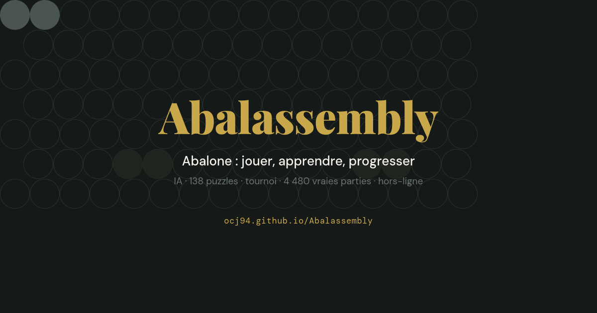
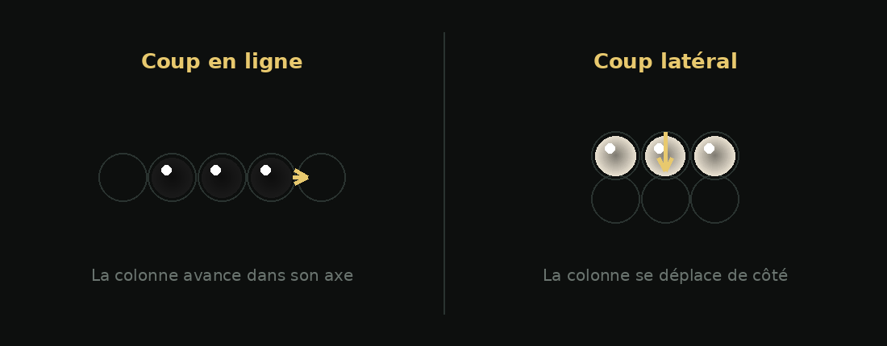
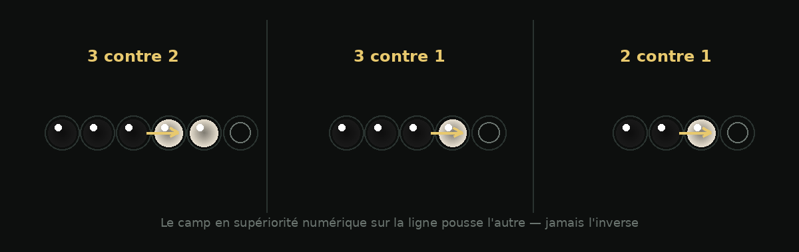

🇫🇷 [Version française](README.md)

# Abalassembly

<p align="center">
  
</p>

*Abalone is a registered trademark of Abalone S.A. (France). This project is an unofficial implementation, with no affiliation to the rights holders.*

**Play, learn and improve at the Abalone strategy game** — entirely in a single HTML file, no server, no dependencies, works offline.

### 🎮 [Play now → ocj94.github.io/Abalassembly](https://ocj94.github.io/Abalassembly/)

Or: open `index.html` in a browser — everything is in there.

## Contents

- [Rules in brief](#rules-in-brief)
- [Kids Mode](#kids-mode)
- [What's in the file](#whats-in-the-file)
- [Exchanging games](#exchanging-games)
- [Technical choices](#technical-choices)
- [Backend (dormant)](#backend-dormant)
- [Development](#development)
- [License](#license)

## Rules in brief

Two players, 14 marbles each, on a hexagonal board. A turn moves a single marble, or a line of 2–3 aligned marbles, one cell, in an open direction. First to eject **6 enemy marbles** off the board wins.

<p align="center">
  
</p>

You can only push an opponent if you outnumber them along the pushing line (a "sumito"):

<p align="center">
  
</p>

| Sumito | Legal? |
|---|---|
| ⚫⚫⚫ pushes ⚪⚪ (3 vs 2) | ✅ |
| ⚫⚫⚫ pushes ⚪ (3 vs 1) | ✅ |
| ⚫⚫ pushes ⚪ (2 vs 1) | ✅ |
| ⚫⚫ vs ⚪⚪, ⚫⚫⚫ vs ⚪⚪⚪ (tied) | ❌ nobody pushes |
| A single marble never pushes | ❌ |

## Kids Mode

A mode built to let a young player sit at the screen alone.

**Where to find it:** ☰ menu → **Settings** → "Kids Mode" card → **Enable**.

What it changes:

- **Lighter board** — the "Discovery" layout, 7 marbles per side instead of 14. Less material to track, shorter games.
- **Move assist** — before any selection, the game highlights every marble that has at least one legal move. The child no longer has to guess which one can move. This runs through the real engine, not an approximation.
- **Bright marble colors**, dedicated skin.

What it hides: **chat**, the **AI Lab**, **settings**, and **external links**. If chat was open, the view switches back to the game tab.

**Exit is locked** behind a two-term addition problem drawn at random. The mode stays active until the answer is correct.

**State is preserved.** Reloading the page doesn't reopen anything: the mode restores itself at startup, and the addition problem still has to be answered to leave it.

## What's in the file

**Play**
- Games against the AI (several levels, alpha-beta + PVS + quiescence engine running in a Web Worker — the interface never freezes; the 2v2/3v2 endgame tablebase is consulted during search, giving an exact result the moment a solved ending is reached)
- Two-player mode on the same screen
- 18 starting-position variants recorded in the AbalOnline library (Belgian Daisy, German Daisy, The Wall, Star…)
- Optional real chess clock: 5+3, 10+5, 20+10 time controls with increment and loss on time (untimed by default)
- Advisor bots (Black Bot / White Bot), bot-vs-bot duels, unlockable marble skins, on-demand 3D view
- **First-person view**: playing White flips the board so your side is always at the bottom. Notation stays absolute either way — `e5` means `e5` regardless of orientation
- **Kids Mode** (see above): lighter board, move assist, locked exit
- **Technical mode** — a global toggle that reveals detailed content (methodology, raw numbers, limitations) on the pages that have it, without cluttering the default player view. Covered pages: Endgame tables, Openings, Lab, Statistics
- **12 languages in the selector** — French is native; English and Hebrew ship with embedded navigation translation (instant, no network needed); the other 9 rely on the browser's native translation, with a guide tailored to Chrome/Firefox/Safari/Edge. **Hebrew in RTL**: sidebar, layout and dropdown menus flip to the right; directional arrows mirror natively (Unicode *bidi-mirrored* characters, no text is rewritten)

**Learn**
- 138 puzzles mined from real games: 126 offensive ("find the move that ejects"), 11 defensive ("parry the ejection threat" — every valid defense accepted), and 1 trivial
- Daily challenge, Storm mode, guided tutorials, academy, illustrated rules
- Move-by-move game analysis: every mistake in the report is clickable and replays the position
- **Post-game analysis**: replays the positions actually reached with the AI's evaluation, and points out where the game turned and on which move the first marble was lost
- **Understanding engine** (Analysis page): for any position, a breakdown of spatial control, support weakness, sumito potential, immediate threats, tactical depth, and 2-move mobility — a short summary by default, the numbers behind Technical mode. A targeted search ("threat in N moves") is available on request, never automatic
- **Positional fingerprint** (same page): a 12-dimension vector per position, invariant under left-right mirroring. Capture a position as a reference, then compare any later position to it (distance shown, per-dimension detail in Technical mode). No historical position database yet — comparison on demand, between explicitly chosen positions
- **Puzzle of the day**, deterministic from the date and identical for everyone, with a streak counter

**Real board**
- Physical board detection from a photo (AI Detection page)
- Real-game recorder: photograph the board after each move, moves are reconstructed automatically by the engine, verified, then saved with players, date and variant — and replayable in the library

**Library**
- 4,480 real games embedded (AbalOnline + MIGS), replayable move by move
- Opening book mined from these games
- **2,589 of these games republished** in [APGN](APGN.md) under [`games/`](games/) — the ones from the MiGs server, which closed on May 30, 2017, and for which no other known public source exists

**Lab**
- Engine self-improvement: SPRT duels (Fishtest/Stockfish-style methodology) and continuous SPSA tuning across 8 evaluation weights (center, cohesion, edge, mobility, isolation, danger, alignments, fortress), with Elo tracking and CSV/JSON exports
- **Real impact, not just a dashboard**: when the Lab statistically proves a new weight set beats the current champion, it's adopted automatically and live-rewrites the AI's "balanced" style — the one used by default until a human opponent's play profile (aggressive/passive) is detected. In other words: the AI you're playing against can genuinely improve from one session to the next.
- Reversible and local: a "Use Lab weights" switch (on by default, can be turned off); everything lives in the browser's `localStorage` — each copy of the game learns for its own player, nothing is shared across devices **as long as the backend stays dormant** (see below: a *distributed* variant of the Lab, where several players feed the same SPRT test, already exists server-side)
- Replay Lab games on a wooden board with the real marble skins

## Exchanging games

**Game by code.** An asynchronous game via a simple text exchange: you play, copy the code, send it; your opponent pastes it, plays, and sends theirs back. No account, no server. The code carries the entire game from the first move, and whoever receives it replays it against the engine — it's rejected at the first illegal move rather than trusted blindly.

**APGN.** Abalone never had an equivalent to chess's PGN. [`APGN.md`](APGN.md) proposes one: a tag header, numbered moves, a result. A game is only valid there if it replays. The converter [`tools/to-apgn.js`](tools/to-apgn.js) produces the file and rejects anything that doesn't pass.

**[`ecosysteme.html`](ecosysteme.html).** An interactive map of the Abalone ecosystem, drawn as a game position: projects enter the board and slide into the gutter when they shut down.

## Technical choices

| Choice | Why |
|---|---|
| **A single HTML file** | Trivial distribution: one file is the whole site. Works over `file://`, on GitHub Pages, from a USB stick. |
| **Zero dependencies** | Nothing to install, nothing to break, nothing third-party to audit. (Only the 3D view loads Three.js, on demand.) |
| **Compressed data banks** | The 4,480 games, the opening book and the sounds are embedded as deflate + base64, decompressed natively on load (`DecompressionStream`). File size ≈ 7.1 MB (grew with the addition of historical fingerprints, endgame tables and the position graph). On an older browser, the game still works — only the library, book and sounds are missing. |
| **Offline-first** | No network request required. Progress, settings and solved puzzles live in `localStorage`. |
| **AI in a Worker** | Search runs on a separate thread; the interface stays smooth while it thinks. |
| **Adaptive multi-worker search** | On a multi-core device, search is split across several Workers (root moves partitioned, each with its own transposition table — no shared memory, since GitHub Pages doesn't set the headers `SharedArrayBuffer` needs). Adapts via `navigator.hardwareConcurrency`: up to 4 workers on a multi-core PC, a single one (same behavior as before) on a constrained phone. |
| **RAM-capped transposition table** | The search cache (TT) scales with `navigator.deviceMemory` (falls back to 4 GB if the API is unavailable) instead of growing without bound — mainly relevant in Minimax mode (unbounded-time search). The cap can never change a result, only cache efficiency once it's reached. |

## Backend (dormant)

An optional backend (accounts, sync, world ranking) exists in the separate [`abalassembly-api`](https://github.com/ocj94/abalassembly-api) repo — Node + Fastify + PostgreSQL + Redis, built GDPR-ready (argon2id, revocable JWT, dependency-free TOTP MFA, automatic purges). It also includes a **distributed Lab**: several players can feed the same collective SPRT test (following [OpenBench](https://github.com/AndyGrant/OpenBench)/Fishtest methodology), with diversity across the 5 official openings and replay-verification of every reference game — 54 tests, green CI. It is **not deployed**: the HTML only calls it if `BACKEND.enabled = true`, which it isn't. As long as that flag is `false`, the site collects nothing and contacts no server.

## Development

The file is deliberately readable: commented sections, unminified code (only the **data** is compressed). To check integrity after a change:

```bash
node tests/regression.js   # integrity, regressions, guardrails — exits 1 if something breaks
node tests/nacre.js        # side-step move notation, checked against the engine
node tests/gamecode.js     # game-code round-trip, 40 games replayed
```

The suite is version-controlled and dependency-free. Every bug fix adds a test that used to fail on the old code. `console.assert` is never used there: it doesn't halt anything, and would let a failed test print as a pass.

Puzzles are mined offline from the game banks using a verifiable criterion (a real ejection threat, with every defense exhaustively recomputed by the engine) — no puzzle is invented by hand.

## License

**GPL-3.0-or-later.** You may use, study, modify and redistribute this game, provided you keep the same license. Games in the library come from public archives (AbalOnline, MiGs) and remain credited to their players. Move records are sequences of fact, not creative works; the MiGs games republished under [`games/`](games/) are there for preservation, with an explicit takedown procedure.
