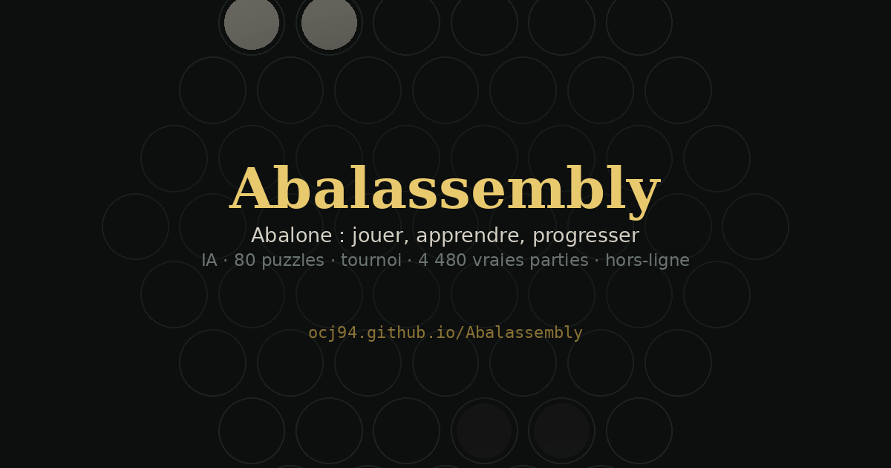
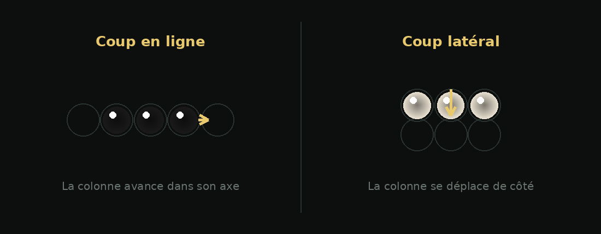
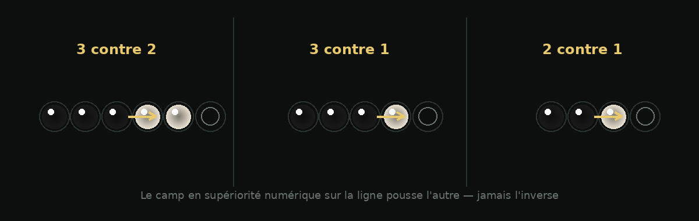

# Abalassembly

<p align="center">
  
</p>

*Abalone est une marque déposée d'Abalone S.A. (France). Ce projet est une implémentation non officielle, sans lien avec les ayants droit.*

**Jouer, apprendre et progresser au jeu de stratégie Abalone** — entièrement dans un seul fichier HTML, sans serveur, sans dépendance, hors-ligne.

### 🎮 [Jouer maintenant → ocj94.github.io/Abalassembly](https://ocj94.github.io/Abalassembly/)

Ou : ouvrez `index.html` dans un navigateur, tout est là.

## Sommaire

- [Règles en bref](#règles-en-bref)
- [Mode Enfant](#mode-enfant)
- [Ce que contient le fichier](#ce-que-contient-le-fichier)
- [Échanger des parties](#échanger-des-parties)
- [Choix techniques](#choix-techniques)
- [Backend (dormant)](#backend-dormant)
- [Développement](#développement)
- [Licence](#licence)

## Règles en bref

Deux joueurs, 14 billes chacun sur un plateau hexagonal. Un tour = déplacer une bille seule ou une colonne de 2-3 billes alignées, d'une case, dans une direction libre. Le premier à éjecter **6 billes adverses** hors du plateau gagne.

<p align="center">
  
</p>

On ne peut pousser l'adversaire que si on est numériquement supérieur sur la ligne de poussée (un « sumito ») :

<p align="center">
  
</p>

| Sumito | Faisable ? |
|---|---|
| ⚫⚫⚫ pousse ⚪⚪ (3 contre 2) | ✅ |
| ⚫⚫⚫ pousse ⚪ (3 contre 1) | ✅ |
| ⚫⚫ pousse ⚪ (2 contre 1) | ✅ |
| ⚫⚫ contre ⚪⚪, ⚫⚫⚫ contre ⚪⚪⚪ (égalité) | ❌ personne ne pousse |
| Une seule bille ne pousse jamais | ❌ |

## Mode Enfant

Un mode conçu pour laisser un jeune joueur seul devant l'écran.

**Où le trouver :** menu ☰ → **Paramètres** → carte « Mode Enfant » → **Activer**.

Ce qu'il change :

- **Plateau allégé** — disposition « Découverte », 7 billes par camp au lieu de 14. Moins de matériel à tenir en tête, parties plus courtes.
- **Aide au coup** — avant toute sélection, le jeu met en évidence toutes les billes qui ont au moins un coup légal. L'enfant ne cherche plus au hasard laquelle peut bouger. Le calcul passe par le moteur réel, il n'est pas approximé.
- **Billes aux couleurs vives**, skin dédiée.

Ce qu'il masque : le **chat**, le **Labo IA**, les **paramètres** et les **liens externes**. Si le chat était ouvert, l'affichage bascule sur l'onglet Jeu.

**La sortie est verrouillée** par une addition à deux termes tirés au hasard. Tant que la réponse est fausse, le mode reste actif.

**L'état est conservé.** Un rechargement de page ne rouvre rien : le mode se remet en place au démarrage, et il faut toujours répondre à l'addition pour en sortir.

## Ce que contient le fichier

**Jeu**
- Partie contre l'IA (plusieurs niveaux, moteur alpha-bêta + PVS + quiescence dans un Web Worker — l'interface ne gèle jamais)
- Mode 2 joueurs sur le même écran
- 18 variantes de position de départ (belge, german daisy, the wall, star…)
- Pendule réelle optionnelle : cadences 5+3, 10+5, 20+10 avec incrément et défaite au temps (mode « libre » par défaut)
- Bots conseillers (Bot Noir / Bot Blanc), duels de bots, skins de billes à débloquer, vue 3D à la demande
- **Vue à la première personne** : avec les blancs, le plateau se retourne pour que votre camp soit toujours en bas. La notation, elle, reste absolue — `e5` désigne `e5` quelle que soit l'orientation
- **Mode Enfant** (voir plus haut) : plateau allégé, aide au coup, sortie protégée

**Apprendre**
- 80 puzzles minés dans de vraies parties : 64 offensifs (« trouve le coup qui éjecte ») et 16 défensifs (« pare la menace d'éjection », toutes les parades valides acceptées)
- Défi du jour, mode Storm, tutoriels guidés, académie, règles illustrées
- Analyse de partie coup par coup : chaque erreur du rapport est cliquable et rejoue la position
- **Analyse d'après-partie** : rejoue les positions réellement traversées avec l'évaluation de l'IA, et indique où la partie a basculé, à quel coup la première bille a été perdue
- **Puzzle du jour**, déterministe par la date et identique pour tout le monde, avec série de jours consécutifs

**Plateau réel**
- Détection d'un plateau physique par photo (page Détection IA)
- Enregistreur de parties réelles : photographiez le plateau après chaque coup, les coups sont reconstitués automatiquement par le moteur, vérifiés, puis sauvegardés avec joueurs, date et variante — et rejouables dans la bibliothèque

**Bibliothèque**
- 4 480 parties réelles embarquées (AbalOnline + MIGS), rejouables coup par coup
- Book d'ouvertures miné depuis ces parties
- **2 589 de ces parties republiées** en [APGN](APGN.md) dans [`games/`](games/) — celles du serveur MiGs, fermé le 30 mai 2017, dont il n'existe aucune autre source publique connue

**Labo**
- Auto-amélioration du moteur : duels SPRT (méthodologie façon Fishtest/Stockfish) et réglage continu SPSA sur 6 poids d'évaluation (centre, cohésion, bord, mobilité, isolement, danger), suivi Elo, exports CSV/JSON
- **Impact réel, pas un simple tableau de bord** : quand le Labo prouve statistiquement qu'un nouveau jeu de poids bat le champion actuel, il est adopté automatiquement et réécrit en direct le style « équilibré » de l'IA — celui utilisé par défaut tant qu'aucun profil de jeu (agressif/passif) n'est détecté chez l'adversaire humain. Autrement dit : l'IA que vous affrontez peut réellement progresser d'une session à l'autre.
- Réversible et local : interrupteur « Utiliser les poids du Labo » (actif par défaut, désactivable) ; tout vit dans le `localStorage` du navigateur — chaque exemplaire du jeu apprend pour son propre joueur, rien n'est partagé entre appareils **tant que le backend reste dormant** (voir plus bas : une variante *distribuée* du Labo, où plusieurs joueurs alimentent le même test SPRT, existe déjà côté serveur)
- Replay des parties du Labo sur plateau bois avec les vrais skins de billes

## Échanger des parties

**Partie par code.** Une partie en différé, par simple échange de texte : vous jouez, vous copiez le code, vous l'envoyez ; votre adversaire le colle, joue, et vous renvoie le sien. Aucun compte, aucun serveur. Le code porte la partie entière depuis le premier coup, et celui qui le reçoit la rejoue contre le moteur — il la refuse au premier coup illégal plutôt que de faire confiance.

**APGN.** L'Abalone n'avait pas d'équivalent du PGN des échecs. [`APGN.md`](APGN.md) en propose un : en-tête de balises, coups numérotés, résultat. Une partie n'y est valide que si elle rejoue. Le convertisseur [`tools/to-apgn.js`](tools/to-apgn.js) produit le fichier et rejette ce qui ne passe pas.

**[`ecosysteme.html`](ecosysteme.html).** Une carte interactive de l'écosystème Abalone, dessinée comme une position de jeu : les projets entrent sur le plateau et glissent dans la gouttière quand ils ferment.

## Choix techniques

| Choix | Pourquoi |
|---|---|
| **Un seul fichier HTML** | Distribution triviale : un fichier = tout le site. Fonctionne en `file://`, sur GitHub Pages, sur clé USB. |
| **Zéro dépendance** | Rien à installer, rien qui casse, rien à auditer chez un tiers. (Seule la vue 3D charge Three.js, à la demande.) |
| **Banques compressées** | Les 4 480 parties, le book et les sons sont embarqués en deflate + base64, décompressés nativement au chargement (`DecompressionStream`). Fichier ≈ 2,5 Mo au lieu de 4,4 Mo. Sur un navigateur ancien, le jeu fonctionne — seules bibliothèque, book et sons sont absents. |
| **Hors-ligne d'abord** | Aucune requête réseau nécessaire. Progression, réglages et puzzles résolus vivent dans le `localStorage`. |
| **IA dans un Worker** | La recherche tourne dans un thread séparé ; l'interface reste fluide pendant la réflexion. |

## Backend (dormant)

Un backend optionnel (comptes, synchronisation, classement mondial) existe dans le dépôt séparé [`abalassembly-api`](https://github.com/ocj94/abalassembly-api) — Node + Fastify + PostgreSQL + Redis, conçu RGPD-ready (argon2id, JWT révocable, MFA TOTP sans dépendance, purges automatiques). Il inclut aussi un **Labo distribué** : plusieurs joueurs peuvent alimenter le même test SPRT collectif (méthodologie [OpenBench](https://github.com/AndyGrant/OpenBench)/Fishtest), avec diversité des 5 ouvertures officielles et vérification par rejeu de chaque partie témoin — 54 tests, CI verte. Il n'est **pas déployé** : le HTML ne l'appelle que si `BACKEND.enabled = true`, ce qui n'est pas le cas. Tant que ce drapeau est à `false`, le site ne collecte rien et ne contacte aucun serveur.

## Développement

Le fichier est volontairement lisible : sections commentées, code non minifié (seules les **données** sont compressées). Pour vérifier l'intégrité après modification :

```bash
node tests/regression.js   # intégrité, régressions, garde-fous — sort en 1 si ça casse
node tests/nacre.js        # notation des coups latéraux, vérifiée contre le moteur
node tests/gamecode.js     # aller-retour du code de partie, 40 parties rejouées
```

La suite est versionnée et sans dépendance. Chaque bug corrigé y ajoute un test qui échouait sur l'ancien code. `console.assert` n'y est jamais utilisé : il n'interrompt rien et laisse un test échoué afficher un succès.

Les puzzles sont minés hors-ligne depuis les banques de parties par un critère vérifiable (menace d'éjection réelle, parades recalculées exhaustivement par le moteur) — aucun puzzle n'est inventé à la main.

## Licence

**GPL-3.0-or-later.** Vous pouvez utiliser, étudier, modifier et redistribuer ce jeu, à condition de conserver la même licence. Les parties de la bibliothèque proviennent de bases publiques (AbalOnline, MiGs) et restent créditées à leurs joueurs. Les relevés de coups sont des suites de faits, non des œuvres ; les parties MiGs republiées dans [`games/`](games/) le sont à des fins de préservation, avec une procédure de retrait explicite.
