🇫🇷 [Version française](Architecture.md)

# Architecture — the diagrams

Three maps for understanding how Abalassembly is built. They are **written by hand** and need to be updated when the architecture changes — unlike the site's own "AI briefing" page, which computes everything at runtime.

Checked against the code at time of writing (v2.45).

---

## 1. How the AI picks its move

Order matters: each step is only reached if the previous one found nothing.

```mermaid
flowchart TD
    A[AI's turn] --> B{Opening book<br/>covers the position?}
    B -->|yes| B1[Move drawn at random,<br/>weighted by frequency × win rate]
    B -->|no| C{Fewer than 20 moves played?}
    C -->|yes| C1{Close position found<br/>among 418,595 fingerprints?}
    C1 -->|yes| C2[Move from the closest<br/>historical position]
    C1 -->|no| D
    C -->|no| D{Fewer than 16 moves<br/>and static book available?}
    D -->|yes| D1[Move from the static book]
    D -->|no| E{Easy level?}
    E -->|yes| E1[Random move<br/>among the top 4]
    E -->|no| F[Alpha-beta search]
    F --> G{Multiple cores<br/>available?}
    G -->|yes| G1[Search split<br/>across several workers]
    G -->|no| G2[Search on a single worker]
    G1 --> H[Move played]
    G2 --> H
    B1 --> H
    C2 --> H
    D1 --> H
    E1 --> H

    style B1 fill:#3a3a1a
    style C2 fill:#3a3a1a
    style D1 fill:#3a3a1a
    style F fill:#1a3a3a
```

**Worth noting**: the historical-fingerprint fallback, sitting between the two books, is easy to forget — it only kicks in during the first twenty moves, when the main book doesn't know the exact position but a very close one exists in the corpus.

---

## 2. Where the data comes from

Everything starts from the same corpus of real games, embedded in the file.

```mermaid
flowchart LR
    S1[MIGS<br/>2,589 games] --> C[Corpus<br/>4,479 real games]
    S2[AbalOnline<br/>1,890 games<br/>18 variants] --> C

    C --> O[Opening books<br/>13 variants]
    C --> E[Historical fingerprints<br/>418,595 positions × 12 dimensions]
    C --> P[Puzzles<br/>138, each sourced]
    C --> ST[Game statistics<br/>first-player advantage, durations...]

    O --> AI[Engine]
    E --> AN[Game analysis]
    E --> AI
    P --> EN[Training]
    ST --> W[Corpus stats page]

    style C fill:#3a3a1a
    style AI fill:#1a3a3a
```

The corpus isn't just a library to browse: it directly feeds the AI's own play (opening books, fingerprint fallback) and the analysis tools.

---

## 3. Game modes and exchanges

```mermaid
flowchart TD
    M[Setup screen] --> A1[Against the AI]
    M --> A2[Two players<br/>same device]
    M --> A3[Live game<br/>WebRTC, experimental]

    A1 --> G[Game in progress]
    A2 --> G
    A3 --> G

    G --> X1[Game by code<br/>text to copy-paste]
    G --> X1b[Game link<br/>?partie= in the URL, one click]
    G --> X2[Aba-Pro export/import<br/>community standard]
    G --> X3[External-engine duel<br/>moves relayed manually]
    G --> X4[Local history<br/>200 games, replayable]

    X2 -.->|no server| EXT[Another Abalone<br/>program]
    A3 -.->|direct connection| P2[Another device]

    style G fill:#3a3a1a
    style A3 fill:#3a2a1a
```

None of these exchanges go through a game server. "Game by code", the direct link, and Aba-Pro export all work even with no network at all — all that's needed is passing along a piece of text or a URL. The link encodes the exact same game code as "Game by code", just carried by the URL instead of copied by hand.

---

## What's kept separate: the endgame tables

The endgame tables (2 vs 2, 3 vs 2) **are not wired into the main engine**. They power Discovery mode, the page documenting how they were computed, and — more recently — the "Proven Endgame" puzzle trainer (positions where the win is proven by retrograde induction, not estimated by the engine).

This is deliberate: the larger classes are out of reach (see [Distributed computing](Calcul-distribue.en.md) for the sizes), and the main takeaway from these tables is a finding rather than a strength gain — **99.9% of 2v2 and 3v2 positions are draws**.

---

## What these diagrams don't show

- The evaluation's internals (eight weights tuned by SPSA) — see [Experimental engine](Moteur-experimental.en.md)
- Why NNUE isn't enabled by default — see the 0/53 measurement on that same page
- The multi-worker limitations — see [Multi-worker engine](Moteur-multi-worker.en.md)
