# Architecture — les schémas

Trois cartes pour comprendre comment Abalassembly est construit. Elles sont **écrites à la main** et doivent être mises à jour quand l'architecture change — contrairement à la « Fiche pour IA » du site, qui compte tout à l'exécution.

Vérifié contre le code au moment de la rédaction (v2.39).

---

## 1. Comment l'IA choisit son coup

L'ordre compte : chaque étape n'est atteinte que si la précédente n'a rien donné.

```mermaid
flowchart TD
    A[Tour de l'IA] --> B{Livre d'ouvertures<br/>couvre la position ?}
    B -->|oui| B1[Coup tiré au sort,<br/>pondéré fréquence × taux de victoire]
    B -->|non| C{Moins de 20 coups joués ?}
    C -->|oui| C1{Position proche dans<br/>les 418 595 empreintes ?}
    C1 -->|oui| C2[Coup de la position<br/>historique la plus proche]
    C1 -->|non| D
    C -->|non| D{Moins de 16 coups<br/>et livre statique ?}
    D -->|oui| D1[Coup du livre statique]
    D -->|non| E{Niveau Facile ?}
    E -->|oui| E1[Coup au hasard<br/>parmi les 4 meilleurs]
    E -->|non| F[Recherche alpha-bêta]
    F --> G{Plusieurs cœurs<br/>disponibles ?}
    G -->|oui| G1[Recherche répartie<br/>sur plusieurs workers]
    G -->|non| G2[Recherche sur un worker]
    G1 --> H[Coup joué]
    G2 --> H
    B1 --> H
    C2 --> H
    D1 --> H
    E1 --> H

    style B1 fill:#3a3a1a
    style C2 fill:#3a3a1a
    style D1 fill:#3a3a1a
    style F fill:#1a3a3a
```

**À noter** : le repli par empreintes historiques, entre les deux livres, est facile à oublier — il ne s'active que dans les vingt premiers coups, quand le livre principal ne connaît pas la position exacte mais qu'une position très proche existe dans le corpus.

---

## 2. D'où viennent les données

Tout part du même corpus de parties réelles, embarqué dans le fichier.

```mermaid
flowchart LR
    S1[MIGS<br/>2 589 parties] --> C[Corpus<br/>4 479 parties réelles]
    S2[AbalOnline<br/>1 890 parties<br/>18 variantes] --> C

    C --> O[Livres d'ouvertures<br/>11 variantes]
    C --> E[Empreintes historiques<br/>418 595 positions × 12 dimensions]
    C --> P[Puzzles<br/>138, chacun sourcé]
    C --> ST[Statistiques du jeu<br/>avantage 1er joueur, durées...]

    O --> AI[Moteur]
    E --> AN[Analyse de partie]
    E --> AI
    P --> EN[Entraînement]
    ST --> W[Page Stats du jeu]

    style C fill:#3a3a1a
    style AI fill:#1a3a3a
```

Le corpus n'est pas seulement une bibliothèque à consulter : il alimente directement le jeu de l'IA (livres d'ouvertures, repli par empreintes) et l'analyse.

---

## 3. Les modes de jeu et les échanges

```mermaid
flowchart TD
    M[Écran de configuration] --> A1[Contre l'IA]
    M --> A2[Deux joueurs<br/>même appareil]
    M --> A3[Partie en direct<br/>WebRTC, expérimental]

    A1 --> G[Partie en cours]
    A2 --> G
    A3 --> G

    G --> X1[Partie par code<br/>échange asynchrone]
    G --> X2[Export/import Aba-Pro<br/>standard communautaire]
    G --> X3[Duel moteur externe<br/>relais manuel des coups]
    G --> X4[Historique local<br/>200 parties, rejouables]

    X2 -.->|aucun serveur| EXT[Autre programme<br/>d'Abalone]
    A3 -.->|connexion directe| P2[Autre appareil]

    style G fill:#3a3a1a
    style A3 fill:#3a2a1a
```

Aucun de ces échanges ne passe par un serveur de jeu. « Partie par code » et l'export Aba-Pro fonctionnent même sans réseau du tout — il suffit de transmettre un texte.

---

## Ce qui est à part : les tablebases

Les tables de finale (2 contre 2, 3 contre 2) **ne sont pas branchées sur le moteur principal**. Elles servent au mode Découverte et à la page qui documente leur calcul.

C'est délibéré : les classes supérieures sont hors de portée (voir [Calcul distribué](Calcul-distribue.md) pour les tailles), et le résultat principal de ces tables est un constat plutôt qu'un gain de force — **99,9 % des positions 2v2 et 3v2 sont des nulles**.

---

## Ce que ces schémas ne montrent pas

- Le détail de l'évaluation (huit poids ajustés par SPSA) — voir [Moteur expérimental](Moteur-experimental.md)
- Pourquoi le NNUE n'est pas activé par défaut — voir la mesure du 0/53 sur la même page
- Les limites du multi-worker — voir [Moteur multi-worker](Moteur-multi-worker.md)
